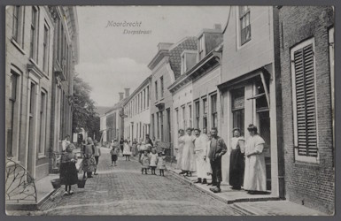
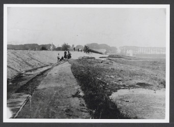
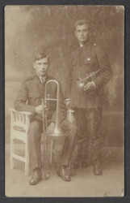
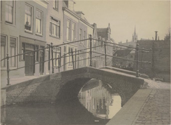
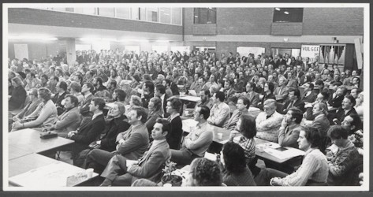
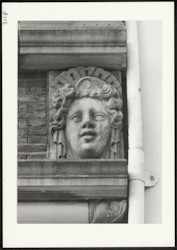
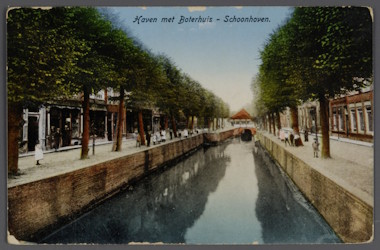

# Herkenbaar API

## Installatie

Creëer en activeer uw virtuele omgeving:

```Bash
python -m venv venv
source venv/bin/activate
```

Installeer alle benodigde pakketten:

```Bash
pip install -r requirements.txt
```

## API starten

Start de API:

```Bash
python app.py
```

API-documentatie is beschikbaar op http://localhost:4050/

## API gebruiken

De **Herkenbaar API** is ontworpen om automatisch te bepalen of er op een afbeelding herkenbare personen afgebeeld worden. Dit is essentieel voor het filteren van uploads in het kader van **portretrecht**.

### Herken in afbeelding via upload
Controleer een lokale afbeelding door deze te uploaden.

* **URL:** `/herken-img`
* **Method:** `POST`
* **Content-Type:** `multipart/form-data`

**Request Body:**
| Parameter | Type | Verplicht | Beschrijving |
| :--- | :--- | :--- | :--- |
| `file` | string (binary) | Ja | Het afbeeldingsbestand (bijv. .jpg of .png) |

**Responses:**
* `200 OK`: Succesvolle detectie.
* `422 Unprocessable Entity`: Validatiefout in de geüploade data.

### Herken in afbeelding via URL
Controleer een online afbeelding door de URL op te geven.

* **URL:** `/herken-url`
* **Method:** `GET`

**Parameters:**
| Parameter | Type | In | Verplicht | Beschrijving |
| :--- | :--- | :--- | :--- | :--- |
| `url` | string | query | Ja | De volledige URL van de afbeelding |

#### Herkenningantwoord

```json
{
  "herkenbaar": "ja", 
  "betrouwbaarheid": 0.9421
}
```

# Voorbeelden

[Buurtfoto (SAMH 0440. 58443)](https://samh.nl/bronnen/beeldbank/detail/1b385bf0-1f1a-5a9d-30ae-2e0e9b3a203b/media/43fb2d11-6ba5-3809-b9e1-c7e96f910b64) > **ja**



[Mensen in de verte (SAMH 0440. 28420)](https://samh.nl/bronnen/beeldbank/detail/7af4bbd0-c697-893c-a698-82331ba98964/media/347ec52f-a92a-d6a1-7b47-b7be4f308a3a) > **nee**



[Muzikanten (SAMH 0440. 65597)](https://samh.nl/bronnen/beeldbank/detail/18f11261-fb82-1eac-10c1-42024b4d7d18/media/70abac34-1e49-d885-55bb-50f24d02f482) > **ja**



[Straatbeeld 1 (SAMH 0440. 72109)](https://samh.nl/bronnen/beeldbank/detail/df124bbe-f1a3-2f3a-af27-1d6211390a3f/media/91cd9556-c1ab-15b2-c86c-af842862c89d) > **nee**



[Bijeenkomst (SAMH 0440. 86696)](https://samh.nl/bronnen/beeldbank/detail/666c5fe6-7c91-c51c-8593-0ff004085692/media/7c9cdd3e-07ac-ff25-76aa-e29948d247da) > **ja**



[Gevellijst (SAMH 0440. 3118)](https://samh.nl/bronnen/beeldbank/detail/90cc13a9-ba1f-575d-c27c-cb8b19c1c3e2/media/180ff8d5-5f16-fa95-f025-91b54fb7f168) > **nee**



[Straatbeeld 2 (SAMH 0440. 61155)](https://samh.nl/bronnen/beeldbank/detail/0332b9b3-68b1-7e64-d3ae-8ba231dc440a/media/e6029902-fbd7-3800-66e3-f8f7441450ae) > **nee**


